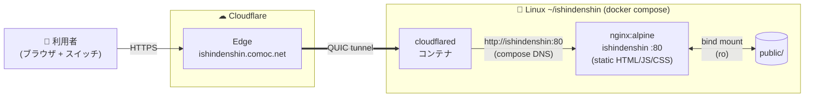

# 意思伝達

ALS・多系統萎縮症 (MSA) など、身体の動作が極めて限定的な方が **たった1つのスイッチ入力（走査入力）** だけで日本語文章を作成できる静的Webアプリ。`Space` / `Enter` キー1つで、50音表からの文字選択・濁点／半濁点・小書き・走査方向の反転までを行えます。

公開: **https://ishindenshin.comoc.net/**

詳細仕様は [docs/Specifications.md](docs/Specifications.md) を参照。本リポジトリは現在、**文字入力画面に絞った初期実装** を提供しています。

## 操作

- **スイッチ**: `Space` または `Enter`
- **走査速度（速く／遅く）**: `→` / `←`
- **一時停止／再開**: `P`
- **メインメニューへ戻る**: `Esc`

走査は 行（縦方向）→ 列（横方向）の二段階で進み、目的の位置に枠が来た瞬間にスイッチを押して文字を確定します。濁点付きのひらがなは選択直後に続けて押すと候補（例: か → が）を切り替えられます。

## 動作要件

- モダンブラウザ（Chrome / Edge / Safari / Firefox の最新版）
- キーボード相当の入力ができる外部スイッチ（`Space` / `Enter` を発火するもの）

サーバ側処理はなく、`getUserMedia` 等の HTTPS 必須機能も使用しないため、ローカルでファイルを開いて動作確認することも可能です。

## システム構成



ingress rules は token モードのため Cloudflare Zero Trust ダッシュボード側で管理（ローカルの `cloudflared/config.yml` は参考用）。

## ポート

| 用途 | ポート | 備考 |
| --- | --- | --- |
| ホスト → nginx コンテナ | `8081` → `80` | [docker-compose.yml](docker-compose.yml) の `ports` で公開。ブラウザから `http://localhost:8081/` でローカル確認 |
| compose 内部ネットワーク | `ishindenshin:80` | cloudflared コンテナが service 名で名前解決して接続。Zero Trust の Public Hostname URL もこの値 |
| 外部公開 | `443` (HTTPS) | Cloudflare Edge が終端し、QUIC トンネル経由で cloudflared コンテナへ |

## セットアップ

### 前提

- Docker / Docker Compose
- Cloudflare アカウントと管理下のドメイン
- Zero Trust ダッシュボードで発行した Tunnel Token

### 手順

1. 設定ファイル準備

   ```sh
   cp .env.example .env
   # TUNNEL_TOKEN=eyJh... を Zero Trust ダッシュボードからコピーして貼り付け
   ```

2. ポート設定

   公開するホスト側ポートは `docker-compose.yml` の `ports`（既定: `8081:80`）で指定します。`8081` が他用途で塞がっている場合は `<空きポート>:80` に変更してください（cloudflared 側の参照は `ishindenshin:80` のままで影響なし）。

3. Cloudflare DNS に CNAME を追加
   - Name: `ishindenshin`（任意のサブドメイン）
   - Target: `<tunnel-uuid>.cfargotunnel.com`
   - Proxy status: **Proxied (オレンジ雲ON)**

4. Zero Trust ダッシュボードで Public Hostname を登録
   - Subdomain: `ishindenshin` / Domain: `comoc.net`
   - Type: **HTTP**
   - URL: `ishindenshin:80`（compose の service 名で解決）

5. 起動

   ```sh
   docker compose up -d
   ```

6. 疎通確認

   ```sh
   curl -I http://localhost:8081/                     # ローカル
   curl -I https://ishindenshin.comoc.net/            # Cloudflare 経由
   docker compose logs -f cloudflared                 # Registered tunnel connection が4本出ればOK
   ```

## ファイル構成

```
.
├── docker-compose.yml        # nginx + cloudflared
├── nginx/default.conf        # Cache-Control: no-cache
├── cloudflared/config.yml    # ingress rules（参考、token モードでは未適用）
├── public/                   # アプリ本体
│   ├── index.html
│   ├── app.js
│   └── styles.css
├── docs/Specifications.md    # 基本仕様書
├── .env.example
└── .gitignore
```

## 編集ワークフロー

`public/` 配下を編集して保存するだけで即反映（nginx はディレクトリを `:ro` でバインドマウント、`Cache-Control: no-cache` でブラウザ／Cloudflare が毎回再検証）。

コンテナ再起動は通常不要。nginx / cloudflared の設定を変えた時だけ `docker compose up -d` を実行。

## ライセンス

[0BSD](LICENSE)
